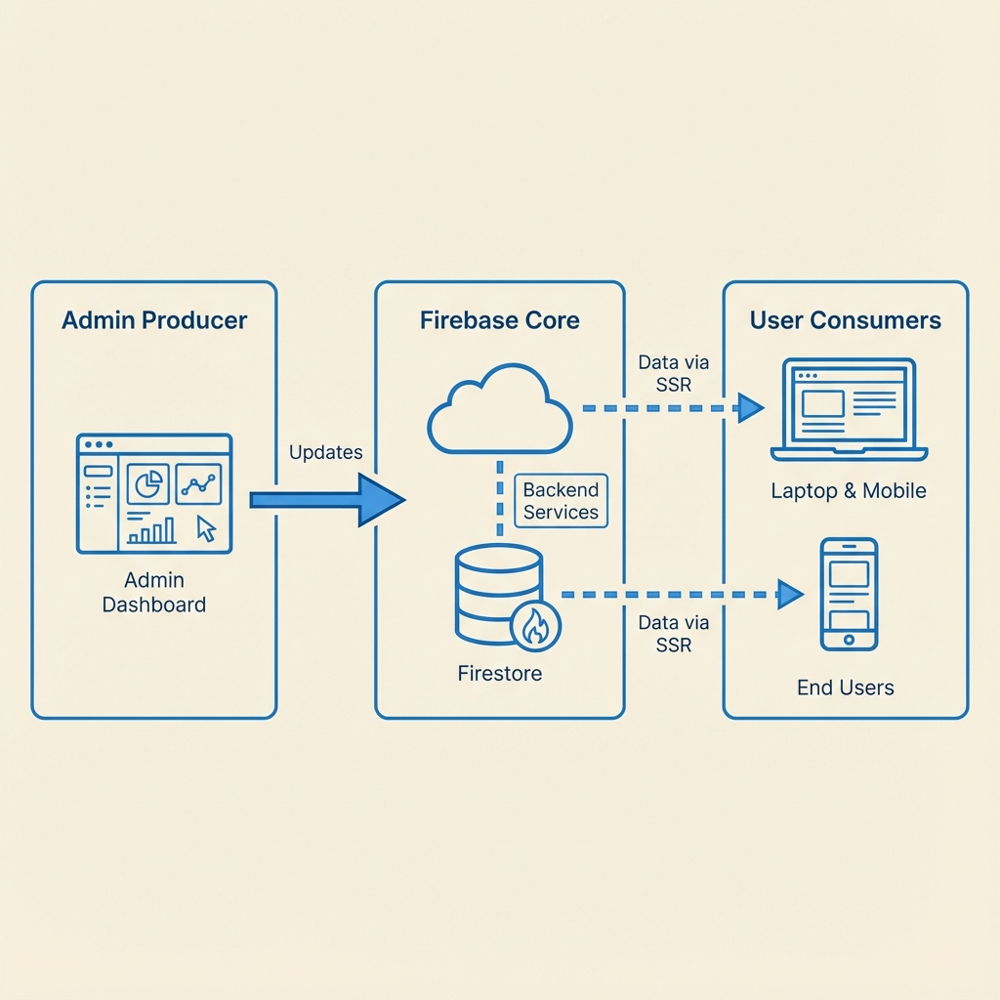
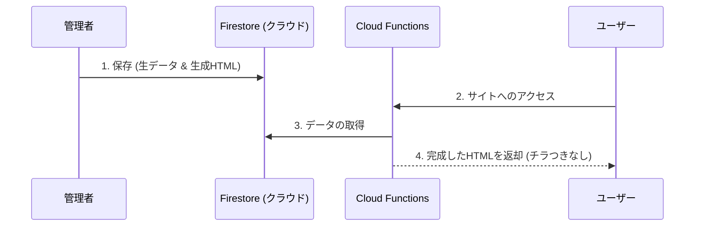

# Hackathon Launch Kit

Firebase と SSR (Server Side Rendering) を活用した、チラつきのない高速なハッカソン管理・公開システムです。

## 🌟 特徴

- **高速表示 (SSR)**: クラウド側でHTMLを組み立ててから届けるため、アクセスした瞬間に内容が表示されます。
- **簡単編集**: 専用の管理画面から、エンジニアでなくてもサイト内容をリアルタイムで更新できます。
- **一元管理**: Firestore への移行により、全てのデータがクラウドで安全に管理されます。

---

## 🏗 システム構成

管理者が保存した「生データ」から「公開用HTML」を自動生成。ユーザーのアクセス時に Cloud Functions (SSR) がそれらを合体させて瞬時に表示します。





---

## 🚀 構築・公開手順 (15分)

### 1. Firebase プロジェクトの準備
1. [Firebase Console](https://console.firebase.google.com/) でプロジェクトを作成します。
2. Firestore（データベース）を有効化し、`admins` コレクションを作成して自分の `email` を登録します。
3. ウェブアプリを登録し、`firebaseConfig` の値をメモします。

### 2. コードの設定
1. `firebase.js` を開き、メモした設定値で上書きします。
2. `npm install` で必要な部品をインストールします。

### 3. デプロイ（公開）
```bash
# ログイン（初回のみ）
npx firebase login

# 組み立てと公開
npm run build && npx firebase deploy
```

---

## 📝 運用方法

- **管理画面**: デプロイされたURLの `/admin.html` からアクセス。
- **ログイン**: 管理者として登録した Google アカウントでログインしてください。
- **更新**: 各タブの内容を編集して「保存」を押すと、即座に公開サイトに反映されます。
